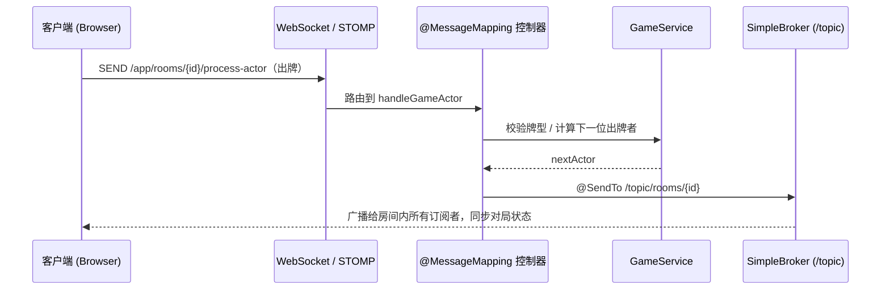

# 🃏 多人在线纸牌对战游戏 · Online Multiplayer Card Game


一款基于 **Spring Boot + WebSocket(STOMP/SockJS)** 实现的 **5 人实时对战网页纸牌游戏**。从用户认证、游戏大厅、房间管理到实时对局与积分结算，完整覆盖一局多人在线棋牌游戏的全流程。后端采用清晰的分层架构，引入 Redis 实现积分排行榜，并提供 Docker Compose 一键启动开发环境；前端使用原生 JavaScript 实现实时交互，并支持断线重连。

> 个人全栈练手项目，用于学习与作品展示。

---

## ✨ 功能特性

- 🔐 **用户系统**：注册 / 登录（Spring Security + BCrypt 加密）、会话管理、个人战绩（对局数 / 胜场 / 积分）。
- 🖼️ **个人资料**：昵称修改、头像上传与在线裁剪（Cropper.js）。
- 🏛️ **游戏大厅**：实时房间列表、创建房间（支持公开 / 密码房，密码经 SHA-256 处理）、加入房间。
- 🪑 **房间管理**：座位分配、准备 / 取消准备、玩家加入 / 离开广播、房主开局。
- 🎮 **实时对局**：发牌、出牌、过牌（PASS）、轮转出牌、自动分队、对局结算，全程基于 WebSocket 实时同步。
- 🏆 **积分排行榜**：基于 **Redis ZSet** 的实时排行榜，支持 TopN 榜单与「我的排名」查询，结算后通过 `ZINCRBY` 增量更新。
- 💬 **房间内聊天**：自由聊天 + 预设快捷语。
- 🔌 **断线重连**：刷新 / 掉线后可恢复完整对局上下文（手牌、当前轮次、上手牌、阵营等）。
- 🔊 **音效与响应式 UI**：出牌 / 过牌 / 开局等音效，适配不同屏幕尺寸。

---

## 🛠️ 技术栈

| 分层 | 技术 |
| --- | --- |
| **语言 / 运行时** | Java 17 |
| **核心框架** | Spring Boot 3.5.5 |
| **实时通信** | Spring WebSocket、STOMP、SockJS |
| **安全认证** | Spring Security、BCrypt |
| **持久层** | Spring Data JPA / Hibernate、MySQL、Druid 连接池 |
| **缓存 / 排行榜** | Redis（Spring Data Redis、Lettuce、ZSet） |
| **容器化** | Docker、Docker Compose（一键拉起 MySQL / Redis / RabbitMQ） |
| **分布式 / 水平扩展** | Spring Session(Redis)、Redisson 分布式锁、RabbitMQ STOMP Broker Relay、Nginx 负载均衡 |
| **可观测性** | Spring Boot Actuator、Micrometer、Prometheus、Grafana |
| **模板引擎** | Thymeleaf |
| **日志** | Log4j2 |
| **工具** | Lombok、Maven |
| **前端** | 原生 JavaScript、SockJS-client、STOMP.js、Cropper.js、HTML5 / CSS3（响应式） |

---

## 🏗️ 系统架构

后端遵循 **Controller → Service → Repository → Model** 的分层结构，实时消息通过 STOMP 的「应用前缀 `/app`」进入业务处理，再由「消息代理前缀 `/topic`」广播回房间内的所有订阅者。

```text
martin.game
├── config/         # 配置：Security / WebMvc / WebSocket(STOMP) / Redis
├── controller/     # 控制器：Auth / Hall / Room / Game(WebSocket) / User / Leaderboard
├── dto/            # 数据传输对象：UserInfo / LeaderboardEntry
├── interceptor/    # 拦截器：基础拦截、WebSocket 握手用户同步
├── model/          # 领域模型：Card / Room / User / GameRound / GameState / SeatType ...
├── repository/     # 数据访问：UserRepository (Spring Data JPA)
├── service/        # 业务逻辑：Game / Room / Hall / User / Leaderboard(Redis ZSet)
├── utils/          # 工具类：GameUtils(牌型规则) / SHA256Utils / LoginUser
├── websocket/      # 房间消息处理器
└── GameApplication.java
```

一次「出牌」动作的实时消息流转：



---

## 🎲 游戏规则简述

- **人数**：5 人一桌。
- **牌组**：一副自定义扑克（去掉除红桃 3 外的所有 3；红桃 3、红桃 4 各 1 张，其余点数各 2 张；含大王 ×2、小王 ×2）。
- **牌力顺序**（由小到大）：`5 < 6 < … < K < A < 2 < 3 = 4 < 小王 < 大王`。
- **隐藏阵营（抓鬼）**：发牌后，持 **红桃 3** 者为「大鬼」、持 **红桃 4** 者为「小鬼」，共 2 名鬼方；其余 3 人为「好人」方。持红桃 3 者获得 **首出牌权**。
- **出牌规则**：可出单张 / 对子 / 三条 / 多张同点；跟牌时**张数需与上家相同且点数更大**，否则只能 PASS；当一圈内无人能压上家时，牌权回到上家。
- **结算**：玩家依次「跑牌出完」，系统按好人 / 小鬼 / 大鬼三方出完的先后顺序，依据预设规则计算每人本局得分并累计到总积分（详见 `GameService#calculateResult`）。

---

## 🚀 快速开始

### 环境要求

- JDK 17+
- MySQL 5.7+ / 8.0+、Redis 6+（推荐用下方 Docker Compose 一键拉起）
- Maven（可直接使用项目自带的 `mvnw` / `mvnw.cmd`）

### 1. 克隆项目

```bash
git clone https://github.com/Martin8311/poker.git
cd poker
```

### 2. 启动依赖中间件（二选一）

**方式一：Docker Compose 一键启动（推荐）** —— 自动拉起 MySQL（含自动建表）、Redis、RabbitMQ：

```bash
cp .env.example .env      # 按需修改密码
docker compose up -d
```

**方式二：使用本地已有的 MySQL / Redis** —— 自行启动服务，并在 MySQL 中执行 `docker/mysql/init.sql` 完成建库建表。

### 3. 配置连接信息（环境变量）

应用通过环境变量读取敏感配置（见 `application.properties`），在 IDE 运行配置或 shell 中设置：

| 变量 | 说明 | 默认值 |
| --- | --- | --- |
| `DB_USERNAME` | 数据库用户名 | `root` |
| `DB_PASSWORD` | 数据库密码 | （必填） |
| `REDIS_HOST` / `REDIS_PORT` | Redis 地址 / 端口 | `localhost` / `6379` |

> 🔒 仓库内不含任何明文密码；本地用 `.env`（已被 `.gitignore` 忽略）或 IDE 环境变量注入。

### 4. 构建并运行

```bash
# Windows
mvnw.cmd spring-boot:run
# Linux / macOS
./mvnw spring-boot:run
```

启动后访问 **http://localhost:8080**。

> 提示：完整对局需要 **5 名玩家**，可用多个浏览器 / 无痕窗口分别注册账号加入同一房间体验。

---

## 🌐 分布式部署（多实例 + Nginx 负载均衡）

项目已完成**无状态化改造**，可水平扩展为「Nginx + 多应用实例」集群。一条命令即可拉起 **Nginx + 2 个应用实例 + MySQL + Redis + RabbitMQ** 的完整分布式环境：

```bash
docker compose up -d --build      # 首次会自动构建应用镜像（多阶段 Maven 构建）
# 浏览器访问统一入口 http://localhost（Nginx 监听 80，负载均衡到 app1 / app2）
```

### 无状态化的三块基石

| 关注点 | 单机实现 | 分布式实现 |
| --- | --- | --- |
| **登录态** | 内存 HttpSession | **Spring Session**：HttpSession 外置 Redis，实例间共享 |
| **房间 / 对局状态** | JVM 内 `ConcurrentHashMap` | **Redis** 存储（`poker:room:{id}`）+ **Redisson 分布式锁**串行化并发 |
| **WebSocket 广播** | 内存版 SimpleBroker（单机） | **RabbitMQ STOMP Broker Relay**：多实例连同一 broker，跨实例广播 |

> **为什么用了 RabbitMQ relay 还需要 Nginx `ip_hash`？** 因为 **SockJS 的 HTTP 兜底传输是有会话的**——同一 SockJS 会话的多次 HTTP 请求必须落到同一实例；而 relay 解决的是**不同实例之间的消息广播**。两者解决不同层面的问题，缺一不可。

### 架构拓扑

```text
                      ┌──────────────┐
        浏览器  ───▶   │  Nginx :80   │  ip_hash 粘性 + /ws WebSocket 升级
                      └──────┬───────┘
                   ┌─────────┴─────────┐
                   ▼                   ▼
             ┌──────────┐        ┌──────────┐
             │   app1   │        │   app2   │   ← 无状态，可任意扩容
             └────┬─────┘        └────┬─────┘
                  └────────┬──────────┘
         ┌─────────────────┼──────────────────┐
         ▼                 ▼                  ▼
    ┌─────────┐      ┌────────────┐     ┌──────────────┐
    │  MySQL  │      │   Redis    │     │   RabbitMQ   │
    │  战绩   │      │ Session /  │     │ STOMP Relay  │
    │  持久化 │      │ 房间 / 榜单│     │  跨实例广播  │
    └─────────┘      └────────────┘     └──────────────┘
```

> 验证无状态：两名玩家被 Nginx 分发到**不同实例**，仍能进入同一房间、实时看到彼此的出牌与聊天 —— 证明登录态、房间状态、消息广播均已跨实例共享。

### 可观测性（Actuator + Prometheus + Grafana）

每个实例通过 **Spring Boot Actuator** 暴露 `/actuator/prometheus`；**Prometheus** 每 15s 直抓 app1 / app2（绕过 Nginx，按 `instance` 标签**分实例**采集）；**Grafana** 自动加载预置仪表盘可视化。`docker compose up -d` 后即可访问：

| 入口 | 地址 | 说明 |
| --- | --- | --- |
| Prometheus | http://localhost:9090 | 指标查询、抓取目标状态（Status → Targets）|
| Grafana | http://localhost:3000 | 预置面板 **Poker - Spring Boot Overview**（默认 `admin` / `admin`）|

面板覆盖：在线房间数（自定义业务指标 `poker_rooms_active`）、各实例 UP 状态、JVM 堆 / 线程 / GC、CPU、HTTP QPS、**p95 延迟**、5xx 错误率，并支持用 `$instance` 变量切换或对比每个实例。

```text
   app1 /actuator/prometheus ┐
                             ├─▶  Prometheus :9090  ─▶  Grafana :3000（仪表盘 + 告警）
   app2 /actuator/prometheus ┘        (TSDB)
```

> Prometheus / Grafana 用官方镜像独立运行，不经过应用的 Maven 构建，因此监控栈可单独拉起。

---

## 📊 排行榜接口

| 方法 | 路径 | 说明 |
| --- | --- | --- |
| `GET` | `/leaderboard/top?n=10` | 积分榜前 N 名 |
| `GET` | `/leaderboard/me` | 当前登录用户的排名与积分 |
| `POST` | `/leaderboard/rebuild` | 从数据库重建排行榜（数据修复 / 调试） |

---

## 💡 核心实现亮点

- **实时通信**：基于 `@EnableWebSocketMessageBroker` 搭建 STOMP/SockJS 通道，以 `/topic/rooms/{roomId}` 做**房间级发布-订阅**，实现发牌、出牌、过牌、聊天、状态同步的低延迟广播；SockJS 提供不支持原生 WebSocket 环境下的自动降级。
- **游戏规则引擎**：从零实现牌组生成与洗牌发牌、出牌合法性校验（牌型 / 张数 / 压牌大小）、基于座位的循环轮转出牌、隐藏阵营自动划分，以及按出完顺序与阵营计算的多分支结算算法。
- **分布式状态与并发控制**：房间 / 对局状态外置到 **Redis**（JSON 序列化），以 `executeWithLock` 模板统一「**Redisson 分布式锁** → 读 Redis → 修改 → 写回」，保证多实例下对同一房间操作的串行与一致；应用因此**无状态、可水平扩展**（旧版为单机 `ConcurrentHashMap` + `ReentrantReadWriteLock`）。
- **Redis 排行榜**：用 **ZSet** 维护积分榜，结算时 `ZINCRBY` 增量更新（O(log N)），`ZREVRANGE` 取 TopN、`ZREVRANK` 查个人排名；Redis 仅作读加速，写入失败时**降级**不阻断主流程，并在**应用启动时从 DB 预热重建**，保证与持久层最终一致。
- **断线重连**：通过独立的 recover 接口，在刷新 / 掉线后还原玩家手牌、当前轮次、上手牌与阵营等完整对局上下文，保障对局连续性。
- **安全与认证**：集成 Spring Security 完成注册登录与会话管理（BCrypt 加密），并自定义 **WebSocket 握手拦截器**将 HTTP 会话身份同步至长连接；采用「广播发牌通知 + 玩家各自拉取手牌」的方式降低手牌泄露风险。
- **数据持久化**：基于 Spring Data JPA + 自定义 `@Modifying` 更新语句持久化用户战绩，支持头像上传与裁剪。

---

## 🗺️ 后续优化方向

- [x] **Redis ZSet 排行榜** + Docker Compose 一键开发环境。
- [x] **RabbitMQ STOMP Broker Relay** 替换内存版 SimpleBroker；**Spring Session + 房间状态外置 Redis + Redisson 分布式锁**实现无状态化；**Nginx + 多实例**水平扩展（见上方「分布式部署」）。
- [x] **消息级鉴权**：`ChannelInterceptor` 做传输层认证 + 订阅房间成员校验，处理器层 `assertSelf` 防身份伪造；并将 WebSocket `allowedOrigin` 收敛为可配置白名单。
- [x] **房间 TTL 租约回收**：在线会话定时续租，无人则随 TTL 过期自动清理残留空房间（崩溃自愈、多实例免协调）。
- [x] **可观测性**：Actuator + Micrometer 暴露指标，Prometheus 分实例抓取，Grafana 预置仪表盘（见上方「可观测性」）。
- [ ] 补充单元测试与集成测试，完善 CI/CD。
- [ ] 增加对局回放、观战与匹配机制。

---

## 📁 目录结构

```text
game
├── src/main/java/martin/game     # 后端 Java 源码
├── src/main/resources
│   ├── static                    # 前端静态资源 (css / js / 牌面图 / 音效 / 头像)
│   ├── templates                 # Thymeleaf 页面 (hall / login / register / room)
│   ├── application.properties    # 应用配置
│   └── log4j2.xml                # 日志配置
├── src/test                      # 测试
├── docker/                       # MySQL 初始化 SQL、RabbitMQ 插件、Nginx 负载均衡配置
├── Dockerfile                    # 应用镜像（多阶段 Maven 构建）
├── docker-compose.yml            # 一键拉起 Nginx + 多实例 + MySQL / Redis / RabbitMQ
├── .env.example                  # 环境变量样例
├── pom.xml                       # Maven 依赖与构建
└── mvnw / mvnw.cmd               # Maven Wrapper
```

---

## 📄 License

本项目基于 [MIT License](LICENSE) 开源，仅供学习与交流使用。

---

> 如有问题或建议，欢迎提交 Issue / PR。
