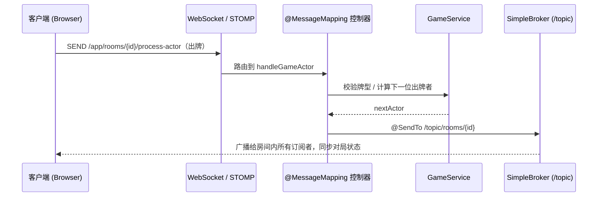

# 🃏 多人在线纸牌对战游戏 · Online Multiplayer Card Game


一款基于 **Spring Boot + WebSocket(STOMP/SockJS)** 实现的 **5 人实时对战网页纸牌游戏**。从用户认证、游戏大厅、房间管理到实时对局与积分结算，完整覆盖一局多人在线棋牌游戏的全流程。后端采用清晰的分层架构，前端使用原生 JavaScript 实现实时交互，并支持断线重连。

> 个人全栈练手项目，用于学习与作品展示。

---

## ✨ 功能特性

- 🔐 **用户系统**：注册 / 登录（Spring Security + BCrypt 加密）、会话管理、个人战绩（对局数 / 胜场 / 积分）。
- 🖼️ **个人资料**：昵称修改、头像上传与在线裁剪（Cropper.js）。
- 🏛️ **游戏大厅**：实时房间列表、创建房间（支持公开 / 密码房，密码经 SHA-256 处理）、加入房间。
- 🪑 **房间管理**：座位分配、准备 / 取消准备、玩家加入 / 离开广播、房主开局。
- 🎮 **实时对局**：发牌、出牌、过牌（PASS）、轮转出牌、自动分队、对局结算，全程基于 WebSocket 实时同步。
- 💬 **房间内聊天**：自由聊天 + 预设快捷语。
- 🔌 **断线重连**：刷新 / 掉线后可恢复完整对局上下文（手牌、当前轮次、上手牌、阵营等）。
- 🔊 **音效与响应式 UI**：出牌 / 过牌 / 开局等音效，适配不同屏幕尺寸。

---

## 🛠️ 技术栈

| 分层 | 技术 |
| --- | --- |
| **语言 / 运行时** | Java 17 |
| **核心框架** | Spring Boot 3.5.5 |
| **实时通信** | Spring WebSocket、STOMP、SockJS |
| **安全认证** | Spring Security、BCrypt |
| **持久层** | Spring Data JPA / Hibernate、MySQL、Druid 连接池 |
| **模板引擎** | Thymeleaf |
| **日志** | Log4j2 |
| **工具** | Lombok、Maven |
| **前端** | 原生 JavaScript、SockJS-client、STOMP.js、Cropper.js、HTML5 / CSS3（响应式） |

---

## 🏗️ 系统架构

后端遵循 **Controller → Service → Repository → Model** 的分层结构，实时消息通过 STOMP 的「应用前缀 `/app`」进入业务处理，再由「消息代理前缀 `/topic`」广播回房间内的所有订阅者。

```text
martin.game
├── config/         # 配置：Security / WebMvc / WebSocket(STOMP)
├── controller/     # 控制器：Auth / Hall / Room / Game(WebSocket) / User
├── dto/            # 数据传输对象
├── interceptor/    # 拦截器：基础拦截、WebSocket 握手用户同步
├── model/          # 领域模型：Card / Room / User / GameRound / GameState / SeatType ...
├── repository/     # 数据访问：UserRepository (Spring Data JPA)
├── service/        # 业务逻辑：Game / Room / Hall / User
├── utils/          # 工具类：GameUtils(牌型规则) / SHA256Utils / LoginUser
├── websocket/      # 房间消息处理器
└── GameApplication.java
```

一次「出牌」动作的实时消息流转：



---

## 🎲 游戏规则简述

- **人数**：5 人一桌。
- **牌组**：一副自定义扑克（去掉除红桃 3 外的所有 3；红桃 3、红桃 4 各 1 张，其余点数各 2 张；含大王 ×2、小王 ×2）。
- **牌力顺序**（由小到大）：`5 < 6 < … < K < A < 2 < 3 = 4 < 小王 < 大王`。
- **隐藏阵营（抓鬼）**：发牌后，持 **红桃 3** 者为「大鬼」、持 **红桃 4** 者为「小鬼」，共 2 名鬼方；其余 3 人为「好人」方。持红桃 3 者获得 **首出牌权**。
- **出牌规则**：可出单张 / 对子 / 三条 / 多张同点；跟牌时**张数需与上家相同且点数更大**，否则只能 PASS；当一圈内无人能压上家时，牌权回到上家。
- **结算**：玩家依次「跑牌出完」，系统按好人 / 小鬼 / 大鬼三方出完的先后顺序，依据预设规则计算每人本局得分并累计到总积分（详见 `GameService#calculateResult`）。

---

## 🚀 快速开始

### 环境要求

- JDK 17+
- Maven 3.6+（或直接使用项目自带的 `mvnw` / `mvnw.cmd`）
- MySQL 5.7+ / 8.0+

### 1. 克隆项目

```bash
git clone https://github.com/<your-username>/<repo-name>.git
cd <repo-name>
```

### 2. 初始化数据库

创建数据库与用户表（JPA 默认不自动建表）：

```sql
CREATE DATABASE IF NOT EXISTS poker DEFAULT CHARACTER SET utf8mb4;

USE poker;

CREATE TABLE IF NOT EXISTS `user` (
  `id`          INT AUTO_INCREMENT PRIMARY KEY,
  `username`    VARCHAR(45)  NOT NULL UNIQUE,
  `password`    VARCHAR(200) NOT NULL,
  `nickname`    VARCHAR(45)  NOT NULL,
  `email`       VARCHAR(45)  DEFAULT NULL,
  `create_time` DATETIME     DEFAULT NULL,
  `total_games` INT          DEFAULT 0,
  `win_games`   INT          DEFAULT 0,
  `score`       INT          DEFAULT 0,
  `iconUrl`     VARCHAR(255) DEFAULT NULL
) ENGINE=InnoDB DEFAULT CHARSET=utf8mb4;
```

### 3. 配置 `application.properties`

编辑 `src/main/resources/application.properties`，填入你的数据库连接与头像存储路径：

```properties
spring.datasource.url=jdbc:mysql://localhost:3306/poker?useSSL=false&serverTimezone=GMT%2B8&characterEncoding=utf8
spring.datasource.username=your_db_username
spring.datasource.password=your_db_password

# 头像文件存储路径（改为你本机 / 服务器上的真实目录）
avatar.upload.path=D:/poker/icon
```

> 🔒 **安全提示**：请勿把**真实数据库密码**提交到版本库。推荐通过**环境变量**注入敏感信息，例如：
> ```properties
> spring.datasource.password=${DB_PASSWORD}
> ```
> 运行前在环境中设置 `DB_PASSWORD`，即可避免明文密码进入 Git。

### 4. 构建并运行

```bash
# Windows
mvnw.cmd spring-boot:run

# Linux / macOS
./mvnw spring-boot:run
```

启动后访问：**http://localhost:8080**

> 提示：完整对局需要 **5 名玩家**。可在多个浏览器 / 无痕窗口分别注册账号加入同一房间进行体验。

---

## 💡 核心实现亮点

- **实时通信**：基于 `@EnableWebSocketMessageBroker` 搭建 STOMP/SockJS 通道，以 `/topic/rooms/{roomId}` 做**房间级发布-订阅**，实现发牌、出牌、过牌、聊天、状态同步的低延迟广播；SockJS 提供不支持原生 WebSocket 环境下的自动降级。
- **游戏规则引擎**：从零实现牌组生成与洗牌发牌、出牌合法性校验（牌型 / 张数 / 压牌大小）、基于座位的循环轮转出牌、隐藏阵营自动划分，以及按出完顺序与阵营计算的多分支结算算法。
- **并发控制**：使用 `ConcurrentHashMap` 管理房间，结合**每房间独立 `ReentrantLock`（`tryLock` 超时）**与 `ReentrantReadWriteLock` 保护玩家状态，规避多人并发操作下的竞态与数据不一致。
- **断线重连**：通过独立的 recover 接口，在刷新 / 掉线后还原玩家手牌、当前轮次、上手牌与阵营等完整对局上下文，保障对局连续性。
- **安全与认证**：集成 Spring Security 完成注册登录与会话管理（BCrypt 加密），并自定义 **WebSocket 握手拦截器**将 HTTP 会话身份同步至长连接；采用「广播发牌通知 + 玩家各自拉取手牌」的方式降低手牌泄露风险。
- **数据持久化**：基于 Spring Data JPA + 自定义 `@Modifying` 更新语句持久化用户战绩，支持头像上传与裁剪。

---

## 🗺️ 后续优化方向

- [ ] 将房间 / 对局状态外置到 **Redis**，并接入外部消息代理（RabbitMQ / ActiveMQ），支持多实例**水平扩展**。
- [ ] 增加 **消息级鉴权**（`messageMatchers`）与接口层统一身份校验，收敛 WebSocket `allowedOrigin` 白名单。
- [ ] 将敏感配置全面迁移至环境变量 / 配置中心。
- [ ] 补充单元测试与集成测试，完善 CI。
- [ ] 增加对局回放、观战与匹配机制。

---

## 📁 目录结构

```text
game
├── src/main/java/martin/game     # 后端 Java 源码
├── src/main/resources
│   ├── static                    # 前端静态资源 (css / js / 牌面图 / 音效 / 头像)
│   ├── templates                 # Thymeleaf 页面 (hall / login / register / room)
│   ├── application.properties    # 应用配置
│   └── log4j2.xml                # 日志配置
├── src/test                      # 测试
├── pom.xml                       # Maven 依赖与构建
└── mvnw / mvnw.cmd               # Maven Wrapper
```

---

## 📄 License

本项目基于 [MIT License](LICENSE) 开源，仅供学习与交流使用。

---

> 如有问题或建议，欢迎提交 Issue / PR。
